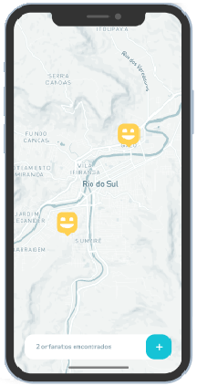

<p align="center">
    
</p>

##

<p align="center">
    

  

  <a href="https://expo.io/">
    
  </a>

  <a href="https://docs.expo.io/versions/v39.0.0/sdk/map-view/">
    
  </a>

  <a href="https://reactnavigation.org/">
    
  </a>

  <a href="https://www.typescriptlang.org/">
    
  </a>

  
</p>

<div align="center">
  
</div>

## :bulb: About Project

Using <span style="color:deepskyblue; font-weight:bold;">React Native</span> with **Expo** and <span style="color:darkslateblue; font-weight:bold;">Typescript</span> to make a **application Happy**, that aims to connect people with orphanages.
Made during the **Next Level Week 03** by Rocketseat :rocket:.

## :gear: Getting Started

```Bash
# Install dependencies
yarn install

# Run application
yarn start
```

## Technology

- [Expo](https://expo.io/)
- [Expo Google Fonts](https://github.com/expo/google-fonts)
- [React Native](https://reactnative.dev/)
- [React Navigation](https://reactjs.org/)